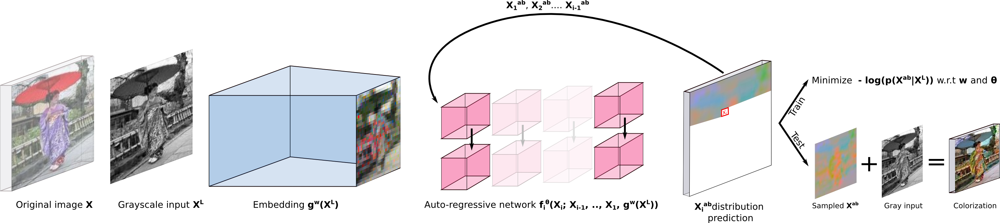
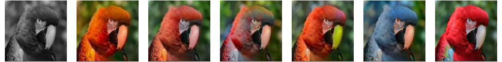

# [PIC] Probabilistic Image Colorization
Tensorflow implementation for [Probabilistic Image Colorization](https://arxiv.org/abs/1705.04258) - generating diverse and vibrant colorization using auto-regressive generative networks - on the CIFAR and ImageNet datasets.




We develop a probabilistic technique for colorizing grayscale natural images. In light of the intrinsic uncertainty of this task, the proposed probabilistic framework has numerous desirable properties. In particular, our model is able to produce multiple plausible and vivid colorizations for a given grayscale image and is one of the first colorization models to provide a proper stochastic sampling scheme. 

Moreover, our training procedure is supported by a rigorous theoretical framework that does not require any ad hoc heuristics and allows for efficient modeling and learning of the joint pixel color distribution. We demonstrate strong quantitative and qualitative experimental results on the CIFAR-10 dataset and the challenging ILSVRC 2012 dataset.





**Figure:** Input grayscale (left), original colored image (rigt) and samples from our model (middle columns)

If you find this work useful, please cite
```
"Probabilistic Image Colorization"
Amelie Royer, Alexander Kolesnikov, Christoph H. Lampert
British Machine Vision Conference (BMVC), 2017
```

## Instructions

#### Dependencies
  * Python 2.6+ or 3+
  * Tensorflow 1.0
  * Numpy
  * h5py
  * skimage
  
#### Train the model

Train on ImageNet.
```bash
python main.py --nr_gpu 4 --batch_size 16 --test_batch_size 25 --init_batch_size 100  \
                -lr 0.00016 -p 0.999 -ld 0.99999 -c 160 -l 4 --downsample 4            \
                --color lab --dataset imagenet --gen_epochs 1 --data_dir [data_dir]
```

Train on CIFAR.
```bash
python main.py --nr_gpu 4 --batch_size 16 --test_batch_size 16 --init_batch_size 100  \
                -lr 0.001 -p 0.999 -ld 0.99995 -c 160 -l 4 --downsample 2              \
                --color lab --dataset cifar --gen_epochs 1 --data_dir [data_dir]
```


#### Apply the model

Download the pre-trained models.
```bash
wget http://pub.ist.ac.at/~aroyer/Models/PIC/cifar_model.tar.gz
tar -xzvf cifar_model.tar.gz
```


```bash
wget http://pub.ist.ac.at/~aroyer/Models/PIC/imagenet_model.tar.gz
tar -xzvf imagenet_model.tar.gz
```

Evaluate the model on the dataset validation split.
(e.g., ImageNet)
```bash
python main.py --nr_gpu 4 --batch_size 16 --test_batch_size 25 --init_batch_size 100  \
               -c 160 -l 4 --downsample 4 --color lab --dataset imagenet --data_dir [data_dir] \
               --mode "eval" --model [path_to_checkpoint]
```

Apply the model on a given input.
```bash
python main.py --nr_gpu 1 --batch_size 16 --test_batch_size 25 --init_batch_size 100  \
               -c 160 -l 4 --downsample 4 --color lab --dataset imagenet \
               --mode "demo" --model [path_to_checkpoint] --input [path to grayscale image]
```
